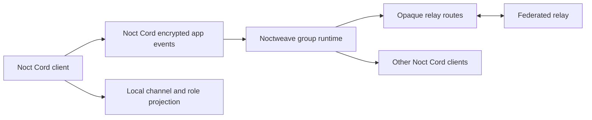

# Noct Cord

Noct Cord is a community chat application built above the Noctweave transport.
It targets a Discord-like experience—spaces, channels, roles, threaded text,
attachments, and eventually voice—without turning relays into trusted
plaintext application servers.

> Status: pre-1.0 UI-ready prototype. The native macOS interface, event model,
> deterministic projection, compact realtime codec, portable identity proofs,
> relay capability assessment, demo, and tests are runnable. Relay-backed sync,
> encrypted persistence, attachments, and the durable shared-log module remain
> implementation work; the current app intentionally uses local preview state.


## What is working

- Native community, channel, member, search, reaction, unread, and composer UX
- Real event projection behind every visible preview message and channel
- Portable ML-DSA identity proofs across communities, or isolated per-space identities
- Fresh group-scoped transport handles regardless of social identity choice
- Compact `nw.realtime-route@1` records and standard Noctweave fallback content
- Relay readiness checks for realtime delivery, durable history, and attachments
- Light, dark, and system appearances using the Noctweave ivory/coral/wine palette

## Why a dedicated application

Noct Cord should be a separate app, not another screen inside Noctweave
Messaging and not privileged JavaScript inside Noctweb Browser.

- Noctweave Messaging is optimized for contacts and compact conversations.
- Noctweb Browser intentionally blocks native bridges, external network access,
  WebRTC, and media capture for rendered publications.
- Noct Cord needs its own navigation, local event store, channel projections,
  moderation UX, notification policy, and future voice media plane.

The native client can reuse `NoctweaveCore`. A web companion can follow later
through `NoctweaveJS` or a narrow, origin-bound Browser capability; neither
route should expose keys or opaque receive capabilities to page code.

## Architecture



One Noct Cord space maps to one Noctweave group. Members use fresh
group-scoped handles. Channels, roles, permissions, messages, edits, reactions,
and pins are encrypted application events. The relay sees opaque packets, not
space names, channel names, membership identities, or message plaintext.

Social identity is selectable per community. A portable client-owned ML-DSA
profile can prove the same identity across many communities and relays, while
isolated mode creates a fresh profile key and publishes no cross-community
binding. Transport credentials remain fresh in both modes. See
[identity design](docs/identity.md).

## Run the app

The package defaults to the public Noctweave repository. During local
development, point it at a checkout:

```sh
export NOCTWEAVE_PACKAGE_PATH="/path/to/NoctweaveCore"
swift test
swift run NoctCordApp
```

To create a launchable macOS bundle:

```sh
export NOCTWEAVE_PACKAGE_PATH="/path/to/NoctweaveCore"
Scripts/build-macos-app.sh release
open "dist/Noct Cord.app"
```

The separate `swift run NoctCordDemo` command builds a two-member space,
creates a channel, projects a message, and encodes the operation as both
`org.noctcord/event:1.0` Noctweave content and a strict compact realtime record.

## Relay compatibility

Current standard relays already support the encrypted-group MVP through
`nw.opaque-route@2`; `nw.blobs@1` supplies encrypted attachments and
`nw.federation@1` supplies cross-relay routing. Noct Cord additionally requires
an immediate-delivery profile: the relay's temporal bucket and multi-bucket
schedule must both be off.

That existing path is a compatibility fallback. The intended realtime path is
`nw.realtime-route@1`: compact variable-length ciphertext records, persistent
WebSocket delivery, strict size ceilings, and no mandatory 4–64 KiB padding.
This spends packet-size privacy to reduce bandwidth, allocations, and latency.
End-to-end encryption, group authentication, replay rejection, and attachment
separation remain mandatory.

Large communities and long history should add a generic `nw.shared-log@1`
module. It stores bounded encrypted records behind opaque capabilities and
cursor sync. It must not know that a log belongs to Noct Cord or interpret
channels, roles, members, or content. See [the relay contract](docs/relay-extension.md).

Immediate, compact delivery exposes more timing and approximate-size
correlation than temporally bucketed, padded Noctweave messaging. Clients and
operators must present that tradeoff clearly rather than describing Noct Cord
traffic as metadata-equivalent.

## Milestones

1. Connect the native app model to `HeadlessMessagingClient` group send/sync.
2. Add encrypted local event persistence and package the responsive UI for iOS.
3. Implement and test `nw.realtime-route@1` and `nw.shared-log@1` in both macOS
   and Linux relays.
4. Add invites, moderation, encrypted attachments, unread projections, and
   optional metadata-explicit presence.
5. Design group call signaling and a separately reviewed media plane.

Security boundaries and rejected embedding alternatives are recorded in
[ADR 0001](docs/adr/0001-application-boundary.md).
