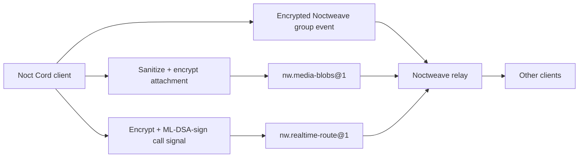

<p align="center">
  
</p>

<a id="noct-cord"></a>

<h1 align="center">Noct Cord</h1>

<p align="center"><strong>Encrypted communities, channels, and calls.</strong></p>

<p align="center">
  <a href="#overview">Overview</a> ·
  <a href="#quick-start">Quick start</a> ·
  <a href="#features">Features</a> ·
  <a href="#security-and-privacy">Security</a> ·
  <a href="#documentation">Documentation</a>
</p>

## Overview

Noct Cord is a native community chat app built on Noctweave. Create encrypted
spaces with channels, roles, durable messages, sanitized attachments, and
small voice rooms. Relays provide transport and availability; application
authority stays with the clients.

| Detail | At a glance |
| --- | --- |
| Platform | macOS app · iOS libraries |
| Built with | Swift 6 · SwiftUI · NoctweaveCore · WebRTC |
| License | [AGPL-3.0-or-later](LICENSE) |

> **Status:** Pre-1.0. Local tests and internal application reviews do not replace an independent audit or signed-device and deployment validation.

<a id="build-and-run-locally"></a>

## Quick start

Run commands from this repository.

Requirements: Swift 6, macOS 14 or later for the desktop app, iOS 17 or later
for the package's iOS surface, and the Swift package dependency
`stasel/WebRTC` M152 (pinned revision). By default, Noct Cord resolves Noctweave from its
public package URL. Start from a source checkout; these commands use the pinned public dependency:

```sh
swift build
swift test
swift run NoctCordDemo
swift run NoctCordApp
```

For local protocol development, set `NOCTWEAVE_PACKAGE_PATH` to the absolute
path of a `NoctweaveCore` checkout before running these commands.

`NoctCordDemo` is deterministic projection/codec smoke coverage. `NoctCordApp`
starts with a full-screen setup flow: review the security boundary, choose the
local display name, optionally paste a community invitation, and connect to a
reachable relay with **Test relay and continue**. It does not create a local
relay or insert a third-party relay. Community admission is available from the
empty state and the community menu after setup.

To build a launchable macOS bundle:

```sh
Scripts/build-macos-app.sh debug
open "dist/Noct Cord.app"
```

The packaging script creates an App Sandbox bundle. It uses launchable ad-hoc
signing by default; set `NOCTCORD_CODESIGN_IDENTITY` to a suitable Developer ID
identity to enable the hardened runtime, secure timestamping, and distribution
signing. The sandbox permits relay and WebRTC networking, microphone capture,
and read-only access to files the user selects. Existing pre-sandbox local state
is not imported automatically. Sandboxed bundles and local `swift run` builds
use separate Keychain rollback-anchor scopes; a mismatch inside either scope
fails before relay I/O and can be cleared only through the explicit destructive
reset shown by the setup flow.

For local UI inspection, a debug bundle can start with deterministic sample
spaces by launching its executable with `NOCTCORD_PREVIEW_DATA=1`. Release
builds always ignore this environment variable.

The package exposes `NoctCordCore`, `NoctCordMedia`, and `NoctCordUI` libraries.
An iOS host application must embed the UI/media libraries, configure signing
and permission declarations, and supply the same relay configuration.

<a id="current-capabilities"></a>

## Features


- **Complete first-run and community admission flow.** Setup explains the
  trust boundary, creates a local display profile, verifies a real relay, and
  discovers the relay operator's optional coturn service while keeping manual
  ICE overrides under Advanced. A community owner can create a bounded
  invitation; the recipient returns a fresh one-use post-quantum admission
  request; and the owner returns a signed Welcome. Acceptance automatically
  requests an encrypted configuration bootstrap, so the new member receives
  the current space, channel, role, bot, voice-room, and disclosed profile
  state without a fourth user-facing exchange.
- **Relay-hosted community model.** Communities remain cryptographically
  owner-controlled while their home relay supplies transport and availability.
  The accepted design lets a relay advertise one official community and choose
  whether additional creation is disabled, operator-only, approval-based, or
  open. Membership is either private by invitation or open to anyone who knows
  the address or finds it through the relay's signed directory. Public
  discovery will reuse signed
  `noct://<community-label>.<relay-suffix>/` publications rather than inventing
  a central directory. An open community's separately scoped admission agent,
  not the relay, signs membership transitions. The registry and admission queue
  are not implemented yet.
- **Encrypted spaces and channels.** One space maps to one Noctweave group.
  Channel creation, messages, edits, reactions, pins, roles, and voice-room
  state are versioned Noct Cord events. The coordinator publishes through
  `HeadlessMessagingClient` and reloads events with the group sync API.
- **Relay-independent communities.** One encrypted client state can retain
  communities on different relays. Joining an invitation registers its relay
  without moving existing communities, saved relays can be selected when a new
  community is created, and each community's sync, attachments, calls, and
  relay assessment use its own stored route. An outage on the setup relay does
  not prevent the app from opening already stored communities.
- **Authenticated community exit.** A member can leave by publishing a signed
  self-removal epoch that removes every active credential scoped to that
  membership. The owner can instead destroy the community with an
  owner-authorized terminal tombstone delivered to current members. Left and
  destroyed communities disappear from the active UI, while their encrypted
  terminal records remain locally to reject stale epochs and replayed traffic;
  relay-retained ciphertext remains governed by the operator's retention
  policy.
- **Local profile and privacy controls.** The profile menu is separate from
  community administration. A member can publish a newly signed display name
  to one or every local community, choose isolated or intentionally portable
  identity scope per community, hide content when the app is unfocused, ask
  macOS to exclude the window from ordinary capture APIs, and disable typing
  assistance in the composer. These controls do not create a global account or
  claim protection from a compromised operating system.
- **Roles and channel access.** Ordered roles provide bounded community
  capabilities, while per-channel everyone/role overrides control viewing,
  sending, attachments, reactions, moderation, and application commands.
  Clients preflight authorization before upload and deterministically reject
  unauthorized received events.
- **Encrypted applications and bots.** An installed app is a dedicated
  Noctweave group member with declared slash commands. Bot code runs in its
  own client process with replay-safe invocation handling; the relay never
  receives a bot token or command plaintext and never executes plugins.
- **Durable state.** The relay stores opaque Noctweave group transport records;
  the client opens an encrypted local `ClientStateStore` and rebuilds a
  deterministic channel projection after relaunch. `nw.shared-log@1` is
  capability-assessed by the client but is not yet the channel-history backend.
- **Sanitized encrypted media.** Images are re-encoded, audio/video are
  freshly exported, PDFs are flattened, and text is normalized before a fresh
  AES-256-GCM attachment key encrypts 64 KiB chunks. The filename and source
  path are never published. Chunks use `nw.media-blobs@1`, a 32-byte opaque
  blob capability, a digest, and a bounded expiry. The current client limit is
  8 MiB after sanitization; the relay module permits up to 32 MiB in total.
- **Voice rooms.** A permitted member can join a room created by a member with
  channel-management permission. The native media layer uses raw WebRTC from
  `stasel/WebRTC` M152 (pinned revision) and creates a peer mesh for audio and renegotiation.
  The current client caps rooms at eight participants so uplink and CPU use do
  not grow without an explicit media-forwarding design.
- **Authenticated custom signaling.** SDP, ICE candidates, join/leave state,
  mute/deafen state, and screen-share control are encoded as media signals,
  encrypted with the room signaling key, authenticated with the member's
  ML-DSA group credential, and carried through the bounded,
  expiry-controlled `nw.realtime-route@1` path.
- **Screen sharing.** macOS uses ScreenCaptureKit for a display capture. iOS
  uses the foreground ReplayKit path. Received tracks are attached to native
  WebRTC Metal renderers in the channel surface, with deterministic
  renegotiation to prevent simultaneous-share offer glare.

## Architecture and relay visibility



The relay can see transport metadata: the connecting endpoint, request timing,
route/blob identifiers, capability-authenticated operation type, sequence or
cursor values, record/chunk sizes, expiry, quotas, and connection health. A
reverse proxy, TURN server, or federation peer may see its own network metadata.

The relay does **not** receive space/channel names, member display names,
group keys, message plaintext, attachment filenames, source paths, attachment
content keys, sanitized media bytes, SDP, or ICE candidates. The media relay
path is signaling storage only; audio/video is exchanged through WebRTC after
negotiation. A TURN operator can observe traffic metadata, but this repository
does not claim an independently audited application-level E2EE layer over the
WebRTC media plane.

## Relay requirements

For text and ordinary group sync, the client requires Noctweave core plus
`nw.opaque-route@2` or `nw.realtime-route@1`, with temporal bucketing disabled.
For current attachment uploads, the relay must advertise
`nw.media-blobs@1`. Voice-room signaling requires a standard relay advertising
`nw.realtime-route@1`; it is not supported by passthrough or host-only relay
roles. The client reads the relay capability manifest and reports missing
modules instead of silently assuming support.

`nw.shared-log@1` and `nw.ephemeral-presence@1` are provisional relay modules.
Noct Cord does not yet require presence, and channel history currently remains on
the encrypted group event path. Do not describe a relay as Noct Cord-ready
unless its advertised capabilities and the relevant interoperability tests
match the feature being enabled.

## Security and privacy

### ICE, permissions, and privacy choices

`NoctCordMediaICEServer` accepts only explicit `stun:`, `stuns:`, `turn:`, or
`turns:` URLs. The client first checks the connected relay's optional
`nw.ice-service@1` advertisement and acquires short-lived coturn credentials
over the authenticated relay connection. Credentials remain in memory and are
refreshed before joining a room. The Advanced setup fields are a manual
session override. No unrelated public STUN/TURN default is inserted; an empty
result intentionally leaves calls limited to directly reachable peers.

Joining a microphone room requests microphone permission through the host OS.
Starting screen share requests the platform-specific capture permission. macOS
requires Screen Recording approval. iOS's current implementation is an
in-app ReplayKit capture and requires user action; it does not include a
Broadcast Upload Extension and does not promise background screen capture.
The application host must add the appropriate usage descriptions and
entitlements to its platform bundle.

### Known limitations

- Pre-1.0 code has no external cryptographic audit or formal proof of the full
  application protocol.
- A compromised operating system, malicious host process, or screen-capture
  observer is outside the protection claim.
- Voice currently uses a native peer mesh; large rooms need a separately
  reviewed media-forwarding design.
- ICE configuration is discovered from the chosen relay or supplied as an
  explicit advanced override. TURN credentials are short-lived and
  session-only; the coturn operator can observe call network metadata.
- Community admission is currently owner-mediated. The bootstrap transfers
  durable configuration, not pre-join message bodies, attachments, presence,
  or call history. If the owner goes offline immediately after approval, the
  accepted member remains joined and receives configuration when the owner
  next synchronizes.
- Final iOS host packaging, ReplayKit behavior, and platform permission flows
  still require signed-device validation.

## Documentation

| Read | For |
| --- | --- |
| [Onboarding and admission](docs/onboarding.md) | Relay setup, invitations, and bootstrap |
| [Identity](docs/identity.md) | Community-scoped identity and local profiles |
| [Roles, channels, and bots](docs/roles-channels-and-bots.md) | Authorization and application semantics |
| [Relay extensions](docs/relay-extension.md) | Capabilities required by each feature |
| [Media and calls](docs/media-and-calls.md) | Attachments, signaling, and media limits |
| [Architecture decisions](docs/adr/) | Application and relay-hosting boundaries |
| [Application audit](https://github.com/luizwidmer/Noctweave/blob/main/NoctweaveDocumentation/app_security_audit_2026-09-21.md) | September 2026 findings and verification limits |

<a id="contributing-and-security"></a>

## Contributing

Read [CONTRIBUTING.md](CONTRIBUTING.md) before proposing changes. Report
vulnerabilities privately using [SECURITY.md](SECURITY.md).

## License

Copyright (C) 2026 Luiz Widmer. Noct Cord is free software licensed under the
[GNU Affero General Public License v3.0 or later](LICENSE).
