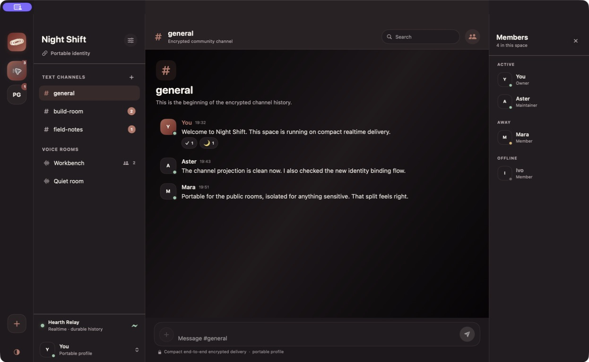
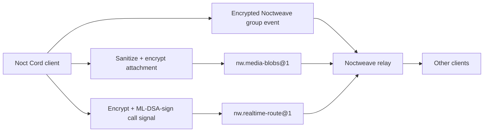

<p align="center">
  
</p>

# Noct Cord

Noct Cord is a native macOS/iOS community-chat client built on the Noctweave
transport. It provides encrypted spaces, channels, roles, durable message
history, sanitized attachments, and multi-member voice rooms without giving a
relay plaintext application authority.

> Status: pre-1.0. The relay, attachment, signaling, and native media paths
> described below are implemented and covered by local interoperability tests,
> but this is not a security-audited or production-certified release. Signed
> device, hostile-network, and deployment validation remain release gates.



## Current capabilities

- **Encrypted spaces and channels.** One space maps to one Noctweave group.
  Channel creation, messages, edits, reactions, pins, roles, and voice-room
  state are versioned Noct Cord events. The coordinator publishes through
  `HeadlessMessagingClient` and reloads events with the group sync API.
- **Durable state.** The relay stores opaque Noctweave group transport records;
  the client opens an encrypted local `ClientStateStore` and rebuilds a
  deterministic channel projection after relaunch. `nw.shared-log@1` is
  capability-assessed by the client but is not yet the channel-history backend.
- **Sanitized encrypted media.** Images are re-encoded, audio/video are
  freshly exported, PDFs are flattened, and text is normalized before a fresh
  AES-256-GCM attachment key encrypts 64 KiB chunks. The filename and source
  path are never published. Chunks use `nw.media-blobs@1`, a 32-byte opaque
  blob capability, a digest, and a bounded expiry. The current client limit is
  8 MiB after sanitization; the relay module permits up to 32 MiB in total.
- **Voice rooms.** A permitted member can join a room created by a member with
  channel-management permission. The native media layer uses raw WebRTC from
  `stasel/WebRTC` 150.0.0 and creates a peer mesh for audio and renegotiation.
  The current client caps rooms at eight participants so uplink and CPU use do
  not grow without an explicit media-forwarding design.
- **Authenticated custom signaling.** SDP, ICE candidates, join/leave state,
  mute/deafen state, and screen-share control are encoded as media signals,
  encrypted with the room signaling key, authenticated with the member's
  ML-DSA group credential, and carried through the bounded,
  expiry-controlled `nw.realtime-route@1` path.
- **Screen sharing.** macOS uses ScreenCaptureKit for a display capture. iOS
  uses the foreground ReplayKit path. Received tracks are attached to native
  WebRTC Metal renderers in the channel surface, with deterministic
  renegotiation to prevent simultaneous-share offer glare.

## Architecture and relay visibility



The relay can see transport metadata: the connecting endpoint, request timing,
route/blob identifiers, capability-authenticated operation type, sequence or
cursor values, record/chunk sizes, expiry, quotas, and connection health. A
reverse proxy, TURN server, or federation peer may see its own network metadata.

The relay does **not** receive space/channel names, member display names,
group keys, message plaintext, attachment filenames, source paths, attachment
content keys, sanitized media bytes, SDP, or ICE candidates. The media relay
path is signaling storage only; audio/video is exchanged through WebRTC after
negotiation. A TURN operator can observe traffic metadata, but this repository
does not claim an independently audited application-level E2EE layer over the
WebRTC media plane.

## ICE, permissions, and privacy choices

`NoctCordMediaICEServer` accepts only explicit `stun:`, `stuns:`, `turn:`, or
`turns:` URLs. An empty ICE list is intentional LAN-only operation. No silent
third-party STUN or TURN default is inserted. Operators or users must provide
their own ICE service and short-lived TURN credentials when NAT traversal is
needed; credentials must not be embedded in the URL.

Joining a microphone room requests microphone permission through the host OS.
Starting screen share requests the platform-specific capture permission. macOS
requires Screen Recording approval. iOS's current implementation is an
in-app ReplayKit capture and requires user action; it does not include a
Broadcast Upload Extension and does not promise background screen capture.
The application host must add the appropriate usage descriptions and
entitlements to its platform bundle.

## Build and run locally

Requirements: Swift 6, macOS 14 or later for the desktop app, iOS 17 or later
for the package's iOS surface, and the Swift package dependency
`stasel/WebRTC` 150.0.0. By default, Noct Cord resolves Noctweave from its
public package URL. For local protocol development, point it at a checkout:

```sh
export NOCTWEAVE_PACKAGE_PATH="/path/to/NoctweaveCore"
swift build
swift test
swift run NoctCordDemo
swift run NoctCordApp
```

`NoctCordDemo` is deterministic projection/codec smoke coverage. `NoctCordApp`
starts with setup enabled: enter a display name and a reachable relay URL,
then use **Test relay and continue**. It does not create a local relay.

To build a launchable macOS bundle:

```sh
export NOCTWEAVE_PACKAGE_PATH="/path/to/NoctweaveCore"
Scripts/build-macos-app.sh debug
open "dist/Noct Cord.app"
```

For local UI inspection, a debug bundle can start with deterministic sample
spaces by launching its executable with `NOCTCORD_PREVIEW_DATA=1`. Release
builds always ignore this environment variable.

The package exposes `NoctCordCore`, `NoctCordMedia`, and `NoctCordUI` libraries.
An iOS host application must embed the UI/media libraries, configure signing
and permission declarations, and supply the same relay configuration.

## Relay requirements

For text and ordinary group sync, the client requires Noctweave core plus
`nw.opaque-route@2` or `nw.realtime-route@1`, with temporal bucketing disabled.
For current attachment uploads, the relay must advertise
`nw.media-blobs@1`. Voice-room signaling requires a standard relay advertising
`nw.realtime-route@1`; it is not supported by passthrough or host-only relay
roles. The client reads the relay capability manifest and reports missing
modules instead of silently assuming support.

`nw.shared-log@1` and `nw.ephemeral-presence@1` are provisional relay modules.
Noct Cord does not yet require presence, and channel history currently remains on
the encrypted group event path. Do not describe a relay as Noct Cord-ready
unless its advertised capabilities and the relevant interoperability tests
match the feature being enabled.

## Known limitations

- Pre-1.0 code has no external cryptographic audit or formal proof of the full
  application protocol.
- A compromised operating system, malicious host process, or screen-capture
  observer is outside the protection claim.
- Voice currently uses a native peer mesh; large rooms need a separately
  reviewed media-forwarding design.
- ICE configuration is exposed under advanced setup and never silently
  populates a third-party STUN/TURN service. TURN credentials are session-only.
- Final iOS host packaging, ReplayKit behavior, and platform permission flows
  still require signed-device validation.

See [identity design](docs/identity.md),
[relay extensions](docs/relay-extension.md),
[media and calls](docs/media-and-calls.md), and
[ADR 0001](docs/adr/0001-application-boundary.md) for the detailed boundaries.
